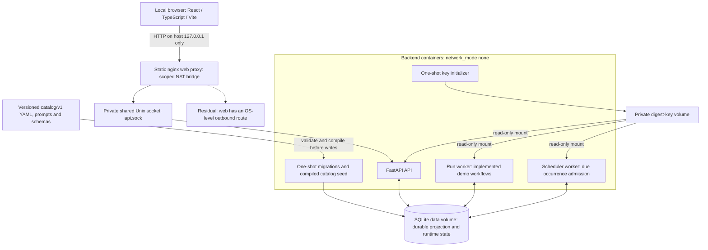

# Marketing Agents architecture

This describes the implemented local platform, not a hosted production design.
“Implemented and verified” below means the linked, scoped verification records
and tests support that behavior; it does not assert a new live deployment test,
green CI, or completion of all acceptance requirements. Current execution status
belongs in [verification](verification.md).

## Components and trust boundaries

Claim: Implemented and verified — the local process/container composition and
restart boundaries are covered by [DEL-05](verification/requirements/DEL-05.md),
[process composition tests](../tests/integration/runtime/test_del_05_process_composition.py),
and [Unix transport tests](../tests/integration/runtime/test_del_05_unix_transport.py).

The diagram represents [compose.yaml](../compose.yaml), the
[runtime composition root](../apps/api/src/marketing_agents/workers/runtime/composition.py),
and [Unix listener](../apps/api/src/marketing_agents/workers/runtime/unix_listener.py).
The API has no published IP port in Compose. The web proxy shares only the IPC
volume with it, not the database or digest key. API/workers use separate processes
and durable database coordination; there is no authoritative in-memory queue or
required external broker. Startup initializes the key, migrates and seeds storage,
then waits for application/worker health.

Claim: Residual risk — the web proxy’s normal NAT bridge retains an outbound
route; loopback publication is not an egress firewall. Backend containers use
`network_mode: none`, and nginx has no external upstream, but this is not a claim
that every container is OS-isolated from outbound traffic. Registry/package
acquisition is a separate network-using phase. Docker administrators, filesystem
administrators, and the self-approving local operator remain trusted. See the
recorded [DEL-05 network qualification](verification/requirements/DEL-05.md).

## Repository layers

Claim: Implemented and verified — [ARCH-08](verification/requirements/ARCH-08.md)
enforces inward dependencies with an
[architecture policy](../architecture-boundaries.json),
[checker](../scripts/verify_architecture_boundaries.py), and
[negative tests](../tests/unit/architecture/test_arch_08_repository_boundaries.py).

- `apps/api/src/marketing_agents/domain`: framework-independent invariants and identities.
- `application`: orchestration, services, policies, and ports.
- `infrastructure`: SQLAlchemy persistence, catalog compilation, and concrete adapters.
- `api`: FastAPI transport and server-owned identity/application composition.
- `workers`: executable composition, bounded run advancement, and scheduling.
- `apps/web/src`: presentation and API transport; no direct database access.

The dependency checker proves its static import rules, not arbitrary reflection,
computed imports, runtime side effects, or a production deployment security model.
[ADR-0001](adr/0001-stack-and-monorepo.md) records the stack decision.

## Catalog authority and database projection

Claim: Implemented and verified — catalog files are the editing authority; the
database is not a second source of template definitions. The
[compiler](../apps/api/src/marketing_agents/infrastructure/catalog/compiler.py)
validates references, schemas, relationships, policies, and the fixed inventory,
then emits an immutable semantic release. Its
[release lock](../catalog/v1/release.lock.json) records **5 departments, 12 functions,
36 templates, and 43 instances**. See [catalog authoring](catalog-authoring.md),
[ADR-0002](adr/0002-catalog-as-versioned-authority.md), and
[inventory tests](../tests/catalog/test_cat_01_authoritative_catalog.py).

The [seed service](../apps/api/src/marketing_agents/infrastructure/catalog/seed.py)
imports catalog-owned identities, relationships, prompts/schema snapshots, and
release history atomically. Instance configuration remains a separate deployment
projection: reseeding preserves existing enabled flags, bindings, schedules,
variant labels, and optimistic revisions. Historical work/run/plan snapshots are
not rewritten by a new release. `seed --check` compares without repair; conflicting
version reuse or incompatible local overrides fail closed. Evidence:
[DEL-04](verification/requirements/DEL-04.md) and
[seed/reseed tests](../tests/integration/db/test_del_04_catalog_seed.py).

## Admission, DAG execution, and typed artifacts

Claim: Implemented and verified — the API admits validated work into durable
work/run records; the scheduler admits due occurrences through the same durable
coordination boundary. The run worker claims bounded work with lease ownership
and fencing, advances it, renews active ownership, and leaves restart recovery to
persisted state. Implementation:
[run loop](../apps/api/src/marketing_agents/workers/runtime/run_loop.py),
[scheduler](../apps/api/src/marketing_agents/workers/runtime/scheduler.py), and
[DEL-05 runtime evidence](verification/requirements/DEL-05.md).

The [DAG domain](../apps/api/src/marketing_agents/domain/graph.py) represents
explicit dependency edges, roots, terminal results, and deterministic topological
ordering independently of agent routing. Cycles, invalid edges, and over-limit
graphs fail before planning. The effect-aware planner snapshots routing,
instance revisions, capabilities, schemas, and bindings; persisted plans and
steps retain structural identity and transition history. Evidence:
[ORCH-03](verification/requirements/ORCH-03.md),
[RUN-02](verification/requirements/RUN-02.md), and
[ORCH-09](verification/requirements/ORCH-09.md).

Step inputs are declared admitted-input fields plus schema-validated artifacts
from allowed ancestor steps, not accumulated chat or the whole original request.
[Bindings](../apps/api/src/marketing_agents/application/orchestration/bindings.py)
preserve provenance, schema/hash identity, and conservative data classification;
unrelated artifacts and invalid pointers fail closed. Evidence:
[ORCH-05](verification/requirements/ORCH-05.md) and
[typed binding tests](../tests/unit/application/test_orch_05_typed_artifact_bindings.py).

Claim: Deterministic mock behavior — the deployed run worker executes the **five
registered demo workflows**. It does not turn all 43 catalog instances into a
general arbitrary-workflow executor. Unsupported workflows fail honestly; webhook
and scheduler fixtures proving admission/replay do not prove generic execution.
The demos produce local artifacts and, only for approved Email actions, durable
mock receipts. See [DEL-03](verification/requirements/DEL-03.md),
[DEL-05](verification/requirements/DEL-05.md), and [demos](demos.md).

## Approval and external-action sequence

Claim: Implemented and verified — write-bearing plans follow this persisted
sequence, covered by [ORCH-08](verification/requirements/ORCH-08.md),
[RUN-05](verification/requirements/RUN-05.md), and
[API-06](verification/requirements/API-06.md):

1. Snapshot exact typed actions, bindings, payload hashes, policy, and the complete
   authorization set; persist proposals and approval requests before any call.
2. Pause at `awaiting_approval`. A server-derived authorized human decides each
   unchanged request. A decision response does not mean an action was delivered.
3. Revalidate every required member. Only the complete approved, unexpired set
   atomically consumes requests, reserves actions, and releases WRITE steps.
4. The dispatcher commits a fenced claim and call-start before invoking the
   connector outside a database transaction.
5. Reconcile an authoritative durable receipt; permit safe same-key replay only
   under the recorded idempotency contract. Unknown outcomes are not blind retries.

Claim: Deterministic mock behavior — Email requires two independent approvals;
one approval causes zero connector calls. After both, the mock newsletter and CRM
actions each receive one durable receipt. This is a local mock guarantee, not
evidence of actual subscription, CRM mutation, or email delivery.

Claim: Residual risk — database transactions cannot make remote effects atomic.
There is no universal distributed exactly-once guarantee or general compensation;
post-call cancellation cannot recall a sent request. See
[ADR-0005](adr/0005-action-scoped-approval.md),
[ADR-0007](adr/0007-external-action-delivery.md), and [adapter contracts](adapter-contracts.md).

## SQLite and optional PostgreSQL

Claim: Implemented and verified — file-backed SQLite is the required local
database and the supplied Compose topology. Database and private digest key are
one restart/recovery unit. Frozen migrations own schema changes; startup does not
replace a lost key or silently adopt an unversioned database. The current local
schema includes DEL-05 revision `0006`. Evidence:
[DEL-04](verification/requirements/DEL-04.md),
[DEL-05](verification/requirements/DEL-05.md), and [operations](operations.md).

Claim: Implemented but not live-tested — optional PostgreSQL support uses the
`postgresql` dependency extra, an explicit `postgresql+asyncpg` URL, repository/UoW
ports, and a preprovisioned database; it is not a switch that makes the network-none
Compose backend reach a PostgreSQL server. DEL-04 records scoped live PostgreSQL
14.17 migration/seed checks. DEL-05’s later `0006` PostgreSQL cases were collected
but not live-run in that record, and this documentation change makes no new
PostgreSQL runtime or race-parity claim. See
[ADR-0003](adr/0003-database-backed-workers.md).
