# Marketing Agents implementation plan

Status: planning baseline

Last updated: 2026-08-17

Source of truth: [`IMPLEMENTATION_PROMPT.md`](../../IMPLEMENTATION_PROMPT.md)

## Purpose

This directory turns the implementation prompt into an executable, reviewable build plan. It is intentionally more detailed than a milestone list: every subject plan identifies the target modules, dependencies, ordered implementation steps, invariants, failure cases, tests, verification commands, and exit criteria.

Nothing in these documents should be read as an implemented or verified control. Until the corresponding code and test evidence exist, every item is a plan or acceptance target.

## Repository baseline

The repository is greenfield at the time this plan was written. It contains the implementation prompt, six local source frames, this planning set, and an initialized but empty Git repository with no commits. It has no application code, dependency manifests, database, tests, CI configuration, Docker configuration, or product documentation beyond this plan. The default stack in the prompt therefore applies:

- Python 3.12, FastAPI, Pydantic, SQLAlchemy, and Alembic.
- React, TypeScript, and Vite.
- SQLite by default, with a configurable database URL and PostgreSQL-compatible domain boundaries.
- Version-controlled YAML plus JSON Schema for the catalog.
- A framework-independent orchestration core with deterministic mocks enabled by default.

## Plan index

| Order | Plan | Primary outcome |
|---:|---|---|
| 0 | [Source evidence, scope, and assumptions](00-source-evidence-scope-and-assumptions.md) | Evidence precedence, non-goals, assumptions, and decisions are explicit. |
| 1 | [Repository scaffold and toolchain](01-repository-scaffold-and-toolchain.md) | Reproducible Python/Node workspace, architecture boundaries, and task runner. |
| 2 | [Catalog schema, seed, and validation](02-catalog-schema-seed-and-validation.md) | Exactly 5 departments, 12 functions, 36 templates, and 43 instances. |
| 3 | [Domain model and invariants](03-domain-model-and-invariants.md) | Pure domain entities, policies, state transitions, action hashes, and provenance. |
| 4 | [Persistence, migrations, and seeding](04-persistence-migrations-and-seeding.md) | Portable schema, transactional repositories, migrations, and repeatable seed. |
| 5 | [Orchestration DAG and run worker](05-orchestration-dag-and-run-worker.md) | Deterministic planning, typed artifacts, bounded execution, retry, and cancellation. |
| 6 | [Approvals, external actions, and idempotency](06-approvals-external-actions-and-idempotency.md) | Immutable action-scoped approval and crash-safe mock side effects. |
| 7 | [Triggers, webhooks, and ingress](07-triggers-webhooks-and-ingress.md) | Validated manual/webhook ingress with signature hooks and replay protection. |
| 8 | [Persistent scheduler](08-persistent-scheduler-timezones-and-recovery.md) | IANA-timezone schedules, concurrent claims, misfires, and restart recovery. |
| 9 | [API, local identity, and errors](09-api-contracts-local-identity-and-errors.md) | Versioned APIs, deployment-only configuration, authorization, and stable errors. |
| 10 | [Model and connector adapters](10-model-and-connector-adapters.md) | Typed ports, deterministic mocks, capability checks, and fail-closed real adapters. |
| 11 | [Deterministic department demos](11-deterministic-department-demos.md) | One schema-valid, provenance-linked scenario for each department. |
| 12 | [Frontend org chart and control surface](12-frontend-org-chart-and-control-surface.md) | Complete hierarchy, details, forms, approvals, timelines, accessibility, and mobile fallback. |
| 13 | [Security, privacy, audit, and retention](13-security-privacy-audit-and-retention.md) | Threat-driven guardrails, redaction, append-only audit, and configurable retention. |
| 14 | [Testing, quality gates, and network isolation](14-testing-quality-gates-and-network-isolation.md) | Layered test suite and evidence that tests cannot contact external services. |
| 15 | [Local operations, documentation, and release](15-local-operations-documentation-and-release.md) | One-command startup, Compose, CI, product docs, and clean-state release proof. |
| 16 | [Requirements traceability matrix](16-requirements-traceability-matrix.md) | Prompt requirements mapped to implementation and verification evidence. |
| 17 | [Proposed file tree and build order](17-proposed-file-tree-and-build-order.md) | Final target layout, ownership boundaries, and safe parallel work packages. |

## Critical dependency path

```mermaid
flowchart LR
    A["Evidence and decisions"] --> B["Scaffold and offline defaults"]
    B --> S["Early security baseline: trust model, redaction, network guards"]
    S --> C["Catalog schema and exact seed"]
    C --> D["Pure domain invariants"]
    D --> E["Persistence and migrations"]
    E --> F["Planner and run worker"]
    D --> G["Provider and connector ports"]
    G --> F
    F --> H["Approvals and external actions"]
    H --> I["Ingress and scheduler"]
    I --> J["API contract"]
    J --> K["Five demos"]
    J --> L["Frontend control surface"]
    K --> L
    L --> M["Final security review and cross-layer acceptance"]
    M --> N["Clean-state release verification"]
```

The catalog gate and approval gate are deliberately early. UI or demo work must not invent temporary role data, mutable-action behavior, or parallel DTOs that later bypass those invariants.

## Milestones and hard gates

| Milestone | Scope | Hard exit gate |
|---|---|---|
| M0 — Decisions | Evidence inventory, ADRs, assumptions, requirement IDs | Every role and ambiguity is accounted for; no logo-derived integration assumptions. |
| M1 — Foundation | Toolchains, workspace, mock-only settings, task runner, import boundaries, threat baseline, sensitivity/redaction contracts, network guards | Empty services boot; static commands execute; redaction canaries and network blockers pass before broad logging/runtime work. |
| M2 — Catalog | Schemas, prompts, capabilities, policies, 36 templates, 43 instances | Exact-count, uniqueness, reference, schema-compilation, and safety-policy tests pass. |
| M3 — Domain and data | Pure entities, state machine, database schema, migrations, seed | Fresh migration and repeat seed pass; local instance overrides survive reseed. |
| M4 — Runtime | Planner, DAG, worker, artifacts, budgets, retries, cancellation, adapters | A read-only run survives a worker restart and produces a valid artifact and complete timeline. |
| M5 — Approval safety | Proposed actions, payload binding, authorization, idempotent dispatcher | Zero calls before all approvals; tamper/reuse/expiry fail; crash retry creates one mock effect. |
| M6 — Ingress | Manual work, webhooks, schedules | Replay and two-worker schedule races each create one run. |
| M7 — Product API | Catalog/config/run/approval/artifact/audit routes and OpenAPI | API integration suite and generated TypeScript contract are clean. |
| M8 — Demos and UI | Five workflows and complete control surface | 43 instances render; all demos pass; Email crosses approval boundary correctly. |
| M9 — Release | Final threat review, retention/observability completion, no-network proof, Compose, docs, clean-state script | One documented command starts fresh; all verification gates pass without credentials. |

## Global implementation rules

1. Keep catalog facts, implementation assumptions, and runtime configuration separate.
2. Keep FastAPI, SQLAlchemy, provider SDKs, and connector SDKs out of the domain layer.
3. Route work deterministically; model output must never choose or invoke tools.
4. Pass typed artifacts and explicit references, never accumulated agent chat history.
5. Treat every external or representational write as an immutable proposed action requiring its own approval.
6. Write a state transition and redacted audit event in the same database transaction.
7. Never hold a database transaction open while waiting for a model or connector.
8. Make every retry bounded and classify ambiguous external outcomes explicitly.
9. Default all runtime modes to deterministic mocks and external network disabled.
10. Reject configuration that weakens a template's seeded policy through an instance override.
11. Preserve stable source order and exact counts in APIs and UI.
12. Document controls as implemented only after the matching verification command passes.

## Planned command contract

The exact implementation may adjust package-manager syntax, but these root commands are the stable developer interface:

| Command | Purpose |
|---|---|
| `make bootstrap` | Install pinned native dependencies and initialize scoped local configuration/key material without requiring an external credential. |
| `make init-local-secret` | Run the shared idempotent digest-key initializer used by native and Compose startup. |
| `make up` | Start the canonical local Compose stack. |
| `make down` | Stop only this project's Compose stack. |
| `make migrate` | Upgrade the database to Alembic head. |
| `make seed` | Validate and transactionally seed the catalog. |
| `make catalog-validate` | Validate all catalog files without a database. |
| `make format-check` | Verify Python, TypeScript, Markdown, and YAML formatting. |
| `make lint` | Run Python and frontend lint checks. |
| `make typecheck` | Run Python and TypeScript static typing. |
| `make test` | Run backend and frontend tests with external network blocked. |
| `make acceptance` | Run cross-layer deterministic demos and browser acceptance tests. |
| `make backup-local` | Create a protected paired local database/digest-key backup bundle. |
| `make restore-local` | Validate and restore a paired bundle into explicitly new scoped storage only. |
| `make verify` | Run all local quality gates. |
| `make verify-clean` | Prove startup and behavior from an isolated fresh database and scoped Compose project. |

## Decisions fixed by this plan

- The source frames determine hierarchy, ordering, names, and role intent; the prompt determines technical behavior.
- Community duplicates use source ordinals only. They do not receive invented regions, audiences, schedules, or business purposes.
- The Marketing Orchestrator is a control-plane service and is excluded from the 43 source instances.
- The first implementation ships no real write connector. Optional real adapters remain fail-closed and outside offline acceptance.
- The Email demo proposes two writes (`newsletter.subscribe` and `crm.upsert-contact`) plus a read-only welcome-message artifact. Both writes must be approved before either connector is called.
- The Community demo produces a reminder draft and a recommended UTC send time; it does not enroll, schedule a provider message, mutate a calendar, or send.
- The local identity provider is explicitly a loopback-only development mechanism, not production authentication.
- SQLite is the required zero-configuration store; database abstractions and schema choices remain PostgreSQL-compatible.
- The UI uses neutral internal capability icons and labels, not copied vendor logos or the source watermark.

## Decisions that must be closed in ADRs before their workstream begins

| Decision | Deadline | Default proposed in this plan |
|---|---|---|
| Failure transitions before `executing` | Before domain state-machine code | Permit auditable transition to `failed` from active processing states, document as a lifecycle extension, and retain every required prompt transition. |
| Self-approval in local demo | Before approval API | Permit for the fixed local operator; keep policy configurable and label the limitation. |
| Optional real LLM adapter | Before adapter implementation | Add one lazily loaded optional adapter with fake-transport tests; no live call is an acceptance requirement. |
| Retention defaults | Before persistence migration is frozen | Use configurable class-specific TTLs and document local defaults; retain a non-sensitive audit skeleton. |
| Approval-request creation route | Before OpenAPI freeze | Planner-owned by default; expose a restricted explicit creation route only if a real UI workflow needs it. |

## Definition of done

Implementation is complete only when all of the following are true:

- The catalog compiler proves 5 departments, 12 functions, 36 templates, and 43 instances with the exact department/function distributions.
- All template schemas, capability references, trigger types, policies, prompts, and source notes validate.
- A fresh database migrates and seeds transactionally; reseeding is idempotent and preserves local deployment overrides.
- The required state lifecycle, cancellation semantics, approval boundary, ingress idempotency, action idempotency, and schedule recovery are persisted and tested.
- Every demo artifact validates against its declared schema and links to source inputs, template, instance, run, step, catalog version, and mock version.
- The Email demo makes zero connector calls until both exact actions are approved, then makes each mock call once.
- The UI presents the complete hierarchy, visibly distinguishes both deployments of every Community template, and supports keyboard, reduced motion, and a narrow-screen semantic tree.
- Health, readiness, configuration, dry-run, webhook, run, artifact, approval, audit, and schedule APIs satisfy their contracts.
- No test contacts an external host, and the default application cannot enable a real adapter accidentally.
- One documented command starts the complete local demo from a clean state with no cloud or provider credentials.
- Formatting, linting, type checking, backend tests, frontend tests, browser smoke tests, and clean-state acceptance all pass.
- Documentation separates verified implementation, deterministic mock behavior, acceptance targets, assumptions, residual risks, and credential-requiring work.

## Tracking rule

The traceability matrix starts with every requirement marked `planned`. During implementation, change status only to one of `implemented`, `verified`, `blocked`, or `deferred`. `Verified` requires a recorded command or test result; code inspection alone is not verification.
